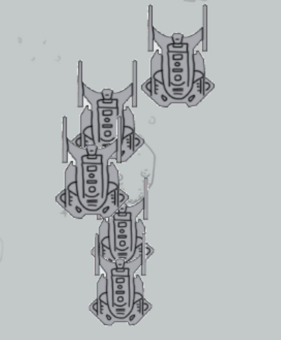

## 💡 关键优化：解决敌机生成重叠问题

**问题现象回顾：**

下图展示了在优化前，敌机生成时可能出现的重叠情况：

**解决方案：**

为了解决这一问题，我们对 `createenemy()` 函数进行了重构。核心改进在于：在为新敌机选择生成位置后，会**遍历当前所有已存活的敌机，并进行碰撞检测**。只有当新提议的位置与所有现有敌机均不发生重叠时，该敌机才会被最终创建。如果多次尝试后仍无法找到合适的非重叠位置，则会采取相应的策略。

**优化后运行效果：**

现在，敌机在出现时能够保持独立，游戏画面更加整洁有序。以下是优化后的实际运行效果演示：

